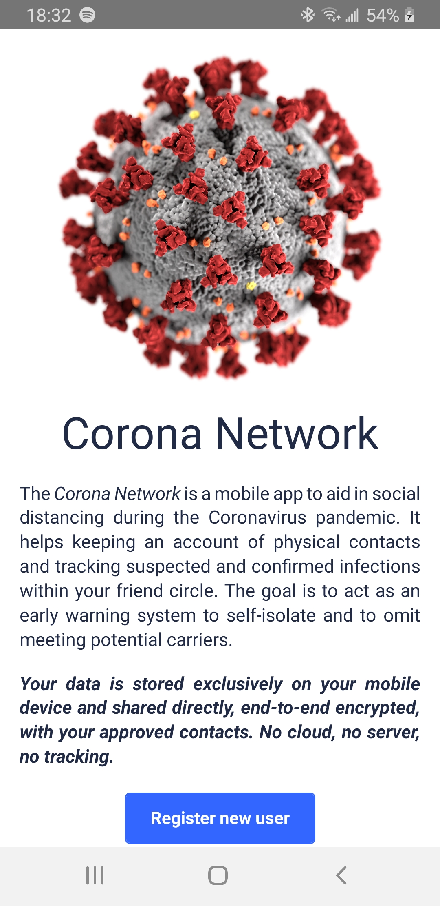

:exclamation: *This project is currently in the phase of figuring out the absolute minimum requirements to be useful; and creating a mock UI (live "Lorem Ipsum" code) to support those requirements. When the mock UI seems usable, we'll go for a functional proof-of-concept, but not before. There's a concurrent feasibility experiment in [`go-coronanet`](https://github.com/coronanet/go-coronanet) for the backend side of things, which also blocks the PoC work to avoid wasting time.* :exclamation:

---

### How to build

The Corona Network mobile app is written in [React Native](https://reactnative.dev/). If you want to contribute to this project, you need to have a valid [Yarn](https://yarnpkg.com/) installation for managing the various build tasks.

If you can run `yarn start` in the repo root successfully, you're halfway there!

#### Android

To build the Android application (`.apk`), you need to have an Android SDK installed. Please consult the Android docs if you're stuck. You might want to do it through [Android Studio](https://developer.android.com/studio). We're not going to use the Android Studio at all, but it's an easy way to manage your SDKs and Android emulators. It also makes things easier if you have an emulator available, so make an `x86_64` one for yourself.

Once Android is configured, you can build and run `rn-coronanet` via:

```
$ yarn run android
```

*Note, you need to have `yarn start` running in another terminal. That will be the server sending live code changes to your emulator (or live device).*

The first time you run this command (and every time the `go-coronanet` dependency is changed), Yarn will download a pre-built Android `.aar` archive containing the Corona Network protocol implementation used in the mobile app. These are pulled from the `go-coronanet` [release page](https://github.com/coronanet/go-coronanet/releases).

Similarly, the first time it might take longer to download all the React Native dependencies, build the Android `.apk`, assemble all the dependencies in a bundle, etc. It will be significantly faster later.

If everything is successful, you should be greeted by the Corona Network welcome screen.

<div style="text-align: center">
  
</div>

#### iOS

iOS is not planned for the initial MVP to keep the scope smaller. A lot of prerequisite work needs to be done on supporting infra first ([`go-libtor`](https://github.com/ipsn/go-libtor), [`go-ghostbridge`](https://github.com/ipsn/go-ghostbridge), [`go-coronanet`](https://github.com/coronanet/go-coronanet), etc), which is wasted time until it's proven to be worth it.

### Contributing

This project is an experiment.

I'm very grateful for any and all contributions, but you must be aware that there are yet-unsolved challenges around running a decentralized social network. There's a fair probability that the project will flop, invest your time accordingly.

The motto behind the code is *"Keep it simple, stupid"* or paraphrasing a similar one from the Go world *"A little copying is better than a little dependency"*. There are hundreds of JavaScript and React Native frameworks that can do epic things. We **don't** need them. There are thousands of things that can be integrated. We **don't** need them.

* Contributions that make the code cleaner or more performant are super welcome.
* Contributions around design changes are very welcome, but please describe what you're trying to do in the issues first. It definitely helps if there's a consistent overarching design.
* Contributions for new features should be approached with care. Adding fancy things in the UI is easy, but the same thing needs to be supported by the `go-coronanet` network protocol too, which is a hard nut to crack. Always discuss first, then see where it goes.

Most importantly, the goal is to **ship fast**, not to compete with Facebook. This project is not one to stroke people's vanity, rather to satisfy its single, specific purpose.

### License

I don't know. This project contains a lot of my free time and a lot of my past ideas and work distilled down. I'm happy to give it all away for making the world a nicer place, but I am not willing to accept anyone making money off of it. Open to suggestions.

Until the above is figured out, contributors agree to grant their code to me ([@karalabe](https://github.com/karalabe)).
